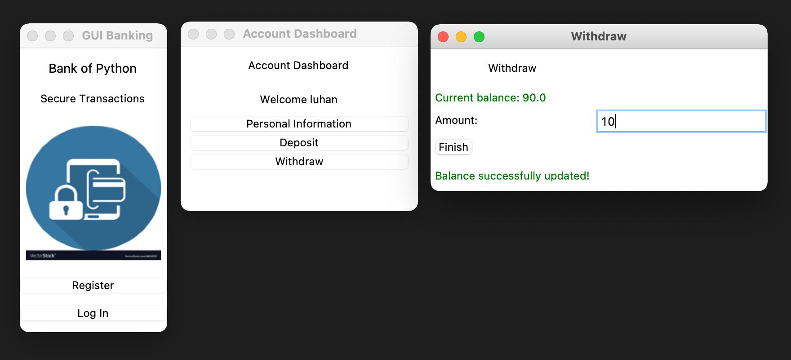

# Python Banking System

### Version 0 - Basics with OOP (app_v0.py)
- Parent class: User (store and display user info)
- Child class: Bank (store info on account balance, amount; allow for deposit, withdraw, and view balance)

### Version 1 - GUI with Tkinter (app_v1.py)
- User can register account

- User can log in if account already existed

- User can view personal information and balance

- User can deposit and withdraw money

